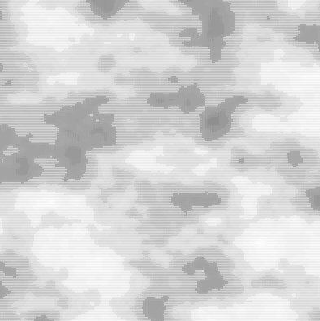

### Como se usa el ruido de perlin?
El ruido de perlin es una tecnica que se usa para generar patrones de variacion natural que son mas suaves que el ruido aleatrio en si. Este se usa en graficos de computador para simular texturas naturales.
En este codigo cada vez que ajustamos los sliders la cuadricula se actualiza, mostrando asi variaciones suaves en el tamaño de cada circulo, gracias al ruido de perlin. Y si aumentamos el offset, los patrones se desplazan, pero de manera continua y suave.

[Enlace a la simulacion](https://editor.p5js.org/DonTuvo/sketches/JWFC9PAhh)

### Codigo

``` js

let xScale = 0.015;
let yScale = 0.02;

let gapSlider;
let gap;
let offsetSlider;
let offset;

function setup() {
  createCanvas(400, 400);

  gapSlider = createSlider(2, width / 10, width / 20);
  gapSlider.changed(dotGrid);
  gapSlider.mouseMoved(checkChanged);
  offsetSlider = createSlider(0, 1000, 0);
  offsetSlider.mouseMoved(checkChanged);
  dotGrid();
}

function checkChanged() {
  if (gap !== gapSlider.value()) {
    dotGrid();
  }
  if (offset !== offsetSlider.value()) {
    dotGrid();
  }
}

function dotGrid() {
  background(255);
  noStroke();
  fill(0);

  gap = gapSlider.value();
  offset = offsetSlider.value();

  for (let x = gap / 2; x < width; x += gap) {
    for (let y = gap / 2; y < height; y += gap) {
      let noiseValue = noise((x + offset) * xScale, (y + offset) * yScale);

      let diameter = noiseValue * gap;
      circle(x, y, diameter);
    }
  }
}
```


