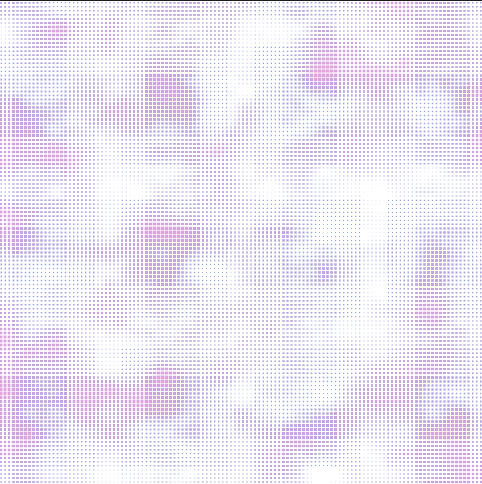

### Aplicacion 

[Enlace de la simulacion](https://editor.p5js.org/DonTuvo/sketches/RQCItaiUf)

#### Captura de la simulacion



#### Codigo lindo

``` js

let xScale = 0.015;
let yScale = 0.02;
let gapSlider, offsetSlider, shapeSelector;
let gap, offset;

function setup() {
  createCanvas(600, 600);
  gapSlider = createSlider(5, width / 10, width / 20);
  gapSlider.position(10, height + 10);
  offsetSlider = createSlider(0, 1000, 0);
  offsetSlider.position(10, height + 40);

  shapeSelector = createSelect();
  shapeSelector.position(10, height + 70);
  shapeSelector.option('Círculos');
  shapeSelector.option('Rectángulos');
  shapeSelector.option('Triángulos');
  
  noLoop();
  dotGrid();
}

function draw() {}

function mouseMoved() {
  if (gap !== gapSlider.value() || offset !== offsetSlider.value()) {
    dotGrid();
  }
}

function dotGrid() {
  background(255);
  noStroke();

  gap = gapSlider.value();
  offset = offsetSlider.value();

  for (let x = gap / 2; x < width; x += gap) {
    for (let y = gap / 2; y < height; y += gap) {
      let noiseValue = noise((x + offset) * xScale, (y + offset) * yScale);
      let diameter = noiseValue * gap;
      
      let shapeType = shapeSelector.value();
      fill(noiseValue * 255, 100, 200, 150);

      if (shapeType === 'Círculos') {
        circle(x, y, diameter);
      } else if (shapeType === 'Rectángulos') {
        let rectSize = diameter;
        rect(x - rectSize / 2, y - rectSize / 2, rectSize, rectSize);
      } else if (shapeType === 'Triángulos') {
        drawTriangle(x, y, diameter);
      }
    }
  }
}

function drawTriangle(x, y, size) {
  beginShape();
  vertex(x, y - size / 2);
  vertex(x - size / 2, y + size / 2);
  vertex(x + size / 2, y + size / 2);
  endShape(CLOSE);
}
```
