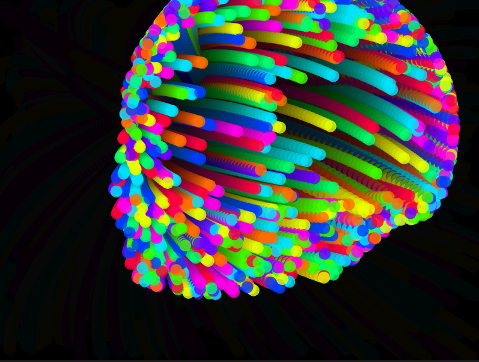

## Codigo 


[Enlace a la simulacion](https://editor.p5js.org/DonTuvo/sketches/29_JKicot)




``` js 
let movers = [];

function setup() {
  createCanvas(800, 600);
  for (let i = 0; i < 1000; i++) {
    movers.push(new Mover(random(width), random(height), i * 1000));
  }
}

function draw() {
  background(0, 7); // Rastros

  for (let mover of movers) {
    mover.applyMouseAcceleration();
    mover.update();
    mover.show();
  }
}

class Mover {
  constructor(x, y, offset) {
    this.position = createVector(x, y);
    this.velocity = createVector(0, 0);
    this.acceleration = createVector(0, 0);
    this.colorOffset = offset; // Color de cada circulo
  }

  applyMouseAcceleration() {
    let mouse = createVector(mouseX, mouseY);
    let direction = p5.Vector.sub(mouse, this.position);
    direction.setMag(0.1);
    this.acceleration = direction;
  }

  update() {
    this.velocity.add(this.acceleration);
    this.position.add(this.velocity);
  }

  show() {
    let hueValue = (frameCount + this.colorOffset) % 360; // Parte para cambiar el color
    colorMode(HSB, 360, 100, 100, 100);
    let c = color(hueValue, 100, 100, 80);
    
    noStroke();
    fill(c);
    ellipse(this.position.x, this.position.y, 20, 20);
  }
}
```
