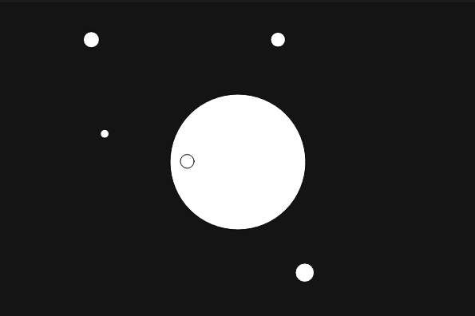

### Explicacion

La simulacion representa el problema de los n-cuerpos con un cuerpo central que atrae a otros objetos mediante una fuerza gravitacional basada en la ley de Newton. A medida que el ciruclo del medio va aumentando en tamaño su atraccion gravitacional se intensifica.




### Codigo

[Enlace a la simulacion](https://editor.p5js.org/DonTuvo/sketches/wENFDAL3s)


``` js
let bodies = [];
let centralBody;
let G = 1;

function setup() {
  createCanvas(600, 400);
  centralBody = new Body(width / 2, height / 2, 5);
  for (let i = 0; i < 5; i++) {
    bodies.push(new Body(random(width), random(height), random(5, 15)));
  }
}

function draw() {
  background(20);

  centralBody.display();
  for (let body of bodies) {
    body.attract(centralBody);
    body.update();
    body.checkEdges();
    body.display();
  }
}

function mousePressed() {
  centralBody.mass += 5;
}

class Body {
  constructor(x, y, mass) {
    this.pos = createVector(x, y);
    this.vel = p5.Vector.random2D().mult(2);
    this.acc = createVector(0, 0);
    this.mass = mass;
  }

  applyForce(force) {
    let f = p5.Vector.div(force, this.mass);
    this.acc.add(f);
  }

  attract(target) {
    let force = p5.Vector.sub(target.pos, this.pos);
    let distanceSq = constrain(force.magSq(), 25, 5000);
    let strength = (G * this.mass * target.mass) / distanceSq;
    force.setMag(strength);
    this.applyForce(force);
  }

  update() {
    this.vel.add(this.acc);
    this.pos.add(this.vel);
    this.acc.mult(0);
  }

  checkEdges() {
    if (this.pos.x < 0 || this.pos.x > width) {
      this.vel.x *= -1;
    }
    if (this.pos.y < 0 || this.pos.y > height) {
      this.vel.y *= -1;
    }
    this.pos.x = constrain(this.pos.x, 0, width);
    this.pos.y = constrain(this.pos.y, 0, height);
  }

  display() {
    fill(255);
    ellipse(this.pos.x, this.pos.y, this.mass * 2);
  }
}
```
