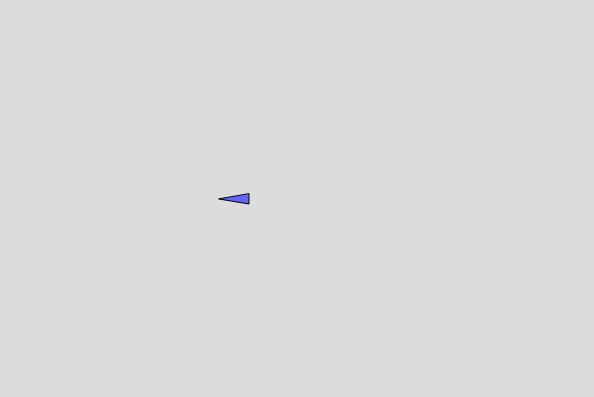

### Carrito

[Enlace a la simulacion](https://editor.p5js.org/DonTuvo/sketches/E4GvntSAi)



``` js 
let vehicle;

function setup() {
  createCanvas(600, 400);
  vehicle = new Vehicle(width / 2, height / 2);
}

function draw() {
  background(220);
  vehicle.update();
  vehicle.display();
}

function keyPressed() {
  if (keyCode === LEFT_ARROW) {
    vehicle.setDirection(-1);
  } else if (keyCode === RIGHT_ARROW) {
    vehicle.setDirection(1);
}

class Vehicle {
  constructor(x, y) {
    this.position = createVector(x, y);
    this.velocity = createVector(2, 0);
    this.direction = 1;
  }

  setDirection(dir) {
    this.direction = dir;
    this.velocity.x = 2 * dir;
  }

  update() {
    this.position.add(this.velocity);

    this.position.x = (this.position.x + width) % width;
  }

  display() {
    push();
    translate(this.position.x, this.position.y);
    scale(this.direction, 1);
    fill(100, 100, 255);
    stroke(0);
    triangle(-15, -5, -15, 5, 15, 0);
    pop();
  }
}
```
