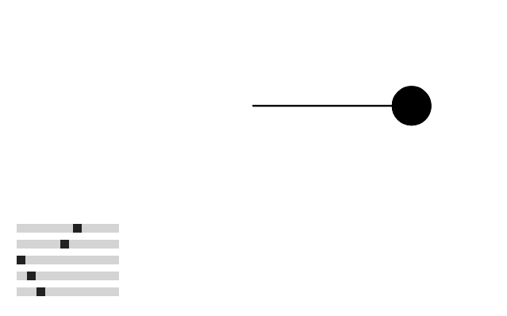

[Enlace a la simulacion](https://editor.p5js.org/DonTuvo/sketches/ox4j9Y3xPu)



### Codigo 

``` js
let amplitudeSlider, periodSlider, phaseSlider, freqSlider, angVelSlider;
let amplitude = 200;
let period = 120;
let phase = 0;
let frequency = 1;
let angularVelocity = 0.05;

function setup() {
  createCanvas(640, 400);
  
  amplitudeSlider = createSlider(50, 300, 200);
  amplitudeSlider.position(20, height - 120);
  
  periodSlider = createSlider(50, 200, 120);
  periodSlider.position(20, height - 100);
  
  phaseSlider = createSlider(0, TWO_PI, 0, 0.01);
  phaseSlider.position(20, height - 80);
  
  freqSlider = createSlider(0.5, 5, 1, 0.1);
  freqSlider.position(20, height - 60);
  
  angVelSlider = createSlider(0.01, 0.2, 0.05, 0.01);
  angVelSlider.position(20, height - 40);
}

function draw() {
  background(255);
  
  amplitude = amplitudeSlider.value();
  period = periodSlider.value();
  phase = phaseSlider.value();
  frequency = freqSlider.value();
  angularVelocity = angVelSlider.value();
  
  let x = amplitude * sin((TWO_PI * frameCount * frequency) / period);
  let x2 = amplitude * sin((TWO_PI * frameCount * frequency) / period + phase);
  
  stroke(0);
  strokeWeight(2);
  translate(width / 2, height / 3);

  fill(127);
  line(0, 0, x, 0);
  circle(x, 0, 48);

  fill(0);
  line(0, 0, x2, 0);
  circle(x2, 0, 48);
  

}
```
