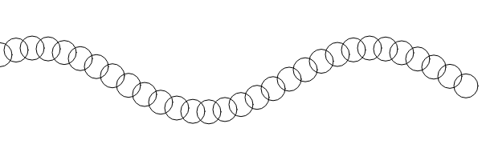

[Enlace a la simulacion](https://editor.p5js.org/DonTuvo/sketches/GF7XwJz-P)




### Codigo

``` js
let numCircles = 30;
let spacing = 20;
let t = 0;

function setup() {
  createCanvas(600, 200);
}

function draw() {
  background(255);
  noFill();
  stroke(0);
  
  for (let i = 0; i < numCircles; i++) {
    let x = i * spacing;
    let y = height / 2 + sin(t + i * 0.3) * 40;
    circle(x, y, 30);
  }
  
  t += 0.05;
}
```
