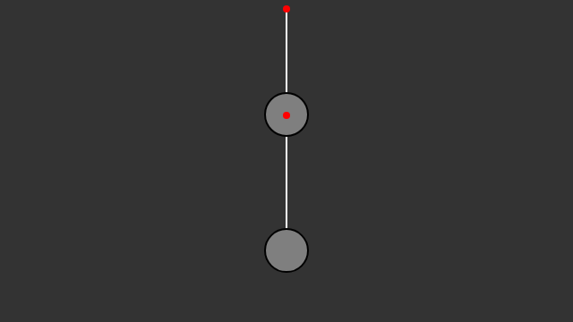

[Enlace a la simulacion](https://editor.p5js.org/DonTuvo/sketches/7cXw02b3t)





``` js
let bob1, bob2;
let spring1, spring2;

function setup() {
  createCanvas(640, 360);
  setFrameRate(60);
  
  let anchorX = width / 2;
  let anchorY = 10;
  
  spring1 = new Spring(anchorX, anchorY, 100);
  bob1 = new Bob(anchorX, anchorY + 100);
  
  spring2 = new Spring(bob1.position.x, bob1.position.y, 100);
  bob2 = new Bob(bob1.position.x, bob1.position.y + 100);
}

function draw() {
  background(51);

  let gravity = createVector(0, 2);
  bob1.applyForce(gravity);
  bob2.applyForce(gravity);
  
  spring1.connect(bob1);
  spring1.constrainLength(bob1, 30, 200);
  
  spring2.anchor.set(bob1.position.x, bob1.position.y);
  spring2.connect(bob2);
  spring2.constrainLength(bob2, 30, 200);
  
  bob1.update();
  bob2.update();

  spring1.displayLine(bob1);
  spring2.displayLine(bob2);
  
  bob1.display();
  bob2.display();
  
  spring1.display();
  spring2.display();
}

function mousePressed() {
  bob2.handleClick(mouseX, mouseY);
}

function mouseDragged() {
  bob2.handleDrag(mouseX, mouseY);
}

function mouseReleased() {
  bob2.stopDragging();
}

class Bob {
  constructor(x, y) {
    this.position = createVector(x, y);
    this.velocity = createVector(0, 0);
    this.acceleration = createVector(0, 0);
    this.mass = 24;
    this.dragging = false;
  }

  applyForce(force) {
    let f = p5.Vector.div(force, this.mass);
    this.acceleration.add(f);
  }

  update() {
    if (!this.dragging) {
      this.velocity.add(this.acceleration);
      this.position.add(this.velocity);
      this.velocity.mult(0.99);
    }
    this.acceleration.mult(0);
  }

  display() {
    fill(127);
    stroke(0);
    strokeWeight(2);
    ellipse(this.position.x, this.position.y, this.mass * 2);
  }

  handleClick(mx, my) {
    let d = dist(mx, my, this.position.x, this.position.y);
    if (d < this.mass) {
      this.dragging = true;
    }
  }

  handleDrag(mx, my) {
    if (this.dragging) {
      this.position.set(mx, my);
    }
  }

  stopDragging() {
    this.dragging = false;
  }
}

class Spring {
  constructor(x, y, restLength) {
    this.anchor = createVector(x, y);
    this.restLength = restLength;
    this.k = 0.1;
  }

  connect(bob) {
    let force = p5.Vector.sub(bob.position, this.anchor);
    let d = force.mag();
    let stretch = d - this.restLength;
    force.normalize();
    force.mult(-this.k * stretch);
    bob.applyForce(force);
  }

  constrainLength(bob, minLength, maxLength) {
    let dir = p5.Vector.sub(bob.position, this.anchor);
    let d = dir.mag();
    if (d < minLength) {
      dir.setMag(minLength);
      bob.position.set(p5.Vector.add(this.anchor, dir));
      bob.velocity.mult(0);
    } else if (d > maxLength) {
      dir.setMag(maxLength);
      bob.position.set(p5.Vector.add(this.anchor, dir));
      bob.velocity.mult(0);
    }
  }

  displayLine(bob) {
    stroke(255);
    strokeWeight(2);
    line(this.anchor.x, this.anchor.y, bob.position.x, bob.position.y);
  }

  display() {
    fill(255, 0, 0);
    noStroke();
    ellipse(this.anchor.x, this.anchor.y, 8, 8);
  }
}
```
