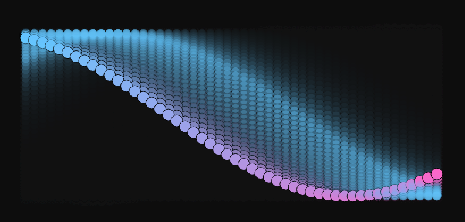

### Selecciona uno de los conceptos con los que experimentaste en la fase de investigación y propón la obra alrededor de este.

Me parecio interesante como las ondas pueden representar patrones naturales y como la interaccion con el usuario puede dar varios resultados solo con algo tan simple como con una onda. A partir de esto decidi diseñar una obra generativa de una onda de movimiento, inspirada mas que todo en las olas.

### Idea de la obra

Esta consiste en una onda que se mueve y cambia dependiento de la interaccion del usuario. La onda deja un rastro que deja una estela creando un efecto visual como si fuera una ola. Se interactua con el teclado ya que con A y D modificas la velocidad de la onda, con el mouse controlas la amplitud y la frecuenta y con espacio activas o desactivas el ruido de perlin.

## Codigo



[Enlace a la simulacion](https://editor.p5js.org/DonTuvo/sketches/4xPTJ8e3Z)

``` js
let numPoints = 50;
let angleOffset = 0;
let amplitude = 50;
let frequency = 0.05;
let speed = 0.02;
let usePerlinNoise = false;

let trail = [];

function setup() {
  createCanvas(800, 400);
}

function draw() {
  background(20, 50);
  
  let phase = angleOffset;
  let yBase = height / 2;
  
  let newTrail = [];

  for (let i = 0; i < numPoints; i++) {
    let x = map(i, 0, numPoints - 1, 50, width - 50);
    let y = yBase + amplitude * sin(phase);

    if (usePerlinNoise) {
      let noiseFactor = noise(i * 0.1, frameCount * 0.01);
      y += map(noiseFactor, 0, 1, -20, 20);
    }

    newTrail.push({ x, y });


    fill(lerpColor(color(100, 200, 255), color(255, 100, 200), i / numPoints));
    stroke(0);
    ellipse(x, y, 20, 20);
    
    phase += frequency;
  }


  trail.push(newTrail);
  if (trail.length > 20) trail.shift();

  for (let t = 0; t < trail.length; t++) {
    let alpha = map(t, 0, trail.length, 50, 0);
    for (let p of trail[t]) {
      fill(100, 200, 255, alpha);
      noStroke();
      ellipse(p.x, p.y, 15, 15);
    }
  }

  angleOffset += speed;
}

function keyPressed() {
  if (key === 'A') speed = max(0.005, speed - 0.005); 
  if (key === 'D') speed += 0.005;
  if (key === ' ') usePerlinNoise = !usePerlinNoise;
}

function mouseMoved() {
  amplitude = map(mouseY, 0, height, 10, 100);
  frequency = map(mouseX, 0, width, 0.01, 0.1);
}
```
