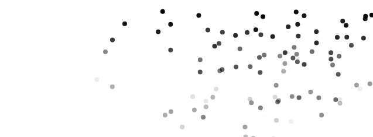
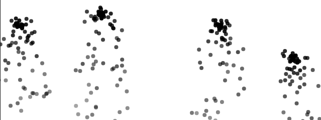
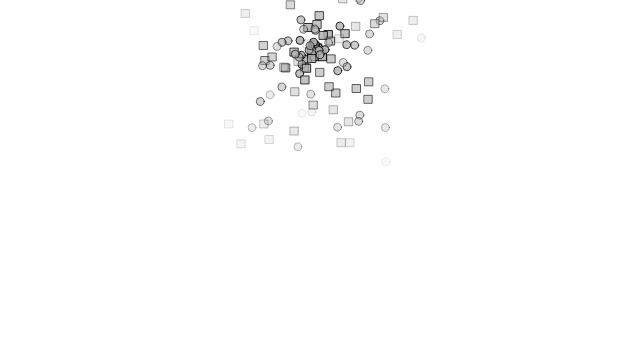
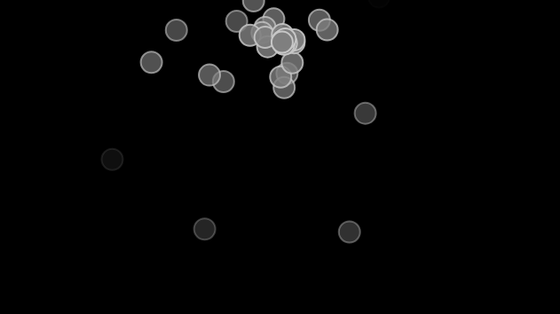
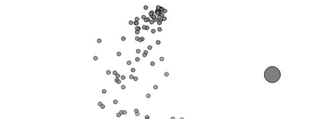

### An Array Of Particles

Se crea la particulas con la funcion ``` draw() ``` en cada fotograma, se agrega una nueva particula al arreglo ``` particles ``` con una poisicion inicial en el centro del lienzo. Para desaparecer las particulas se recorre el arreglo ``` particles ``` en orden inverso para ver si alguna particula ha muerto ``` isDead() ``` eliminandola del arreglo con ``` splice(i , 1), para la gestion de memoria se eliminan particulas innecesarias evitando el  consumo excesivo de memoria.


#### Codigo y concepto

Lo unico que modifique en la gestion del codigo fue la creacion de particulas, ahora estas se generan con mayor probabilidad en la parte derecha del canva en lugar de distribuirse uniformemente.

Utilice la distribuccion no uniforme, en vez de generar particulas con una distribuccion uniforme se utilizo una transformacion de valores aleatorios para aumentar la probabilidad de que las particulas aparezcan en la parte derecho de la pantalla.

[Codigo original](https://natureofcode.com/particles/#example-42-an-array-of-particles)

[Codigo modificado](https://editor.p5js.org/DonTuvo/sketches/9QiXFFOy5)




### A System Of Systems

La gestion de las particulas y memoria es igual a el inciso anterior 

#### Codigo y concepto

Aplique la aceleracion en las particulas permitiendo que su movimiento varie en vez de ser uniforme.

[Codigo original](https://natureofcode.com/particles/#example-44-a-system-of-systems)

[Codigo modificado](https://editor.p5js.org/DonTuvo/sketches/2JvCwkZFQ)




### A Particle System with Inheritance and Polymorphism

Se crea un sistema de particulas ``` ParticleSystem ``` que en cada fotograma genera particulas nuevas en un punto especifico del canva, pero cada particula puede ser de un tipo diferente debido a la herencia y el polimorfismo. En cuestiones de desaparicion y gestion de memoria es lo mismo.

#### Codigo y concepto

Le aplique gravedad lunar asi las particulas no caen igual que antes

[Codigo original](https://natureofcode.com/particles/#example-45-a-particle-system-with-inheritance-and-polymorphism)

[Codigo modificado](https://editor.p5js.org/DonTuvo/sketches/C1kynympd)




### A Particle System with Forces

La gestion de las particulas y memoria es igual a el inciso anterior 

#### Codigo y concepto

Le aplique Perlin Noise para mover las particulas de forma mas natural, en vez de asignarles valores aleatorios.

[Codigo original](https://editor.p5js.org/DonTuvo/sketches/rb741QWwQ)

[Codigo modificado](https://editor.p5js.org/DonTuvo/sketches/rb741QWwQ)




### A Particle System with a Repeller

La gestion de las particulas y memoria es igual a el inciso anterior 

#### Codigo y concepto

Le aplique Levy Flight al repeledor para que las particulas se vayan moviendo dependiendo donde se mueva el repeledor.

[Codigo original](https://natureofcode.com/particles/#example-47-a-particle-system-with-a-repeller)

[Codigo modificado](https://editor.p5js.org/DonTuvo/sketches/KvGb6pNKr)


