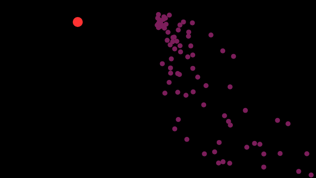

## Aplicacion 

[Enlace a la aplicacion](https://editor.p5js.org/DonTuvo/sketches/hteoJdOUA)



#### Qué concepto de cada unidad aplicaste, cómo lo aplicaste y por qué.

##### 1. Moviemnto Motion 101 

En la clase ```Particle``` aplique fuerza con el metodo ```aplyForce()``` afectando asi la aceleracion. Esta se suma a la velocidad y la velocidad se suma a la posicion en ```update()```.

##### 2. Fuerzas Externas

Aplique fuerza de gravedad a las particulas en ``` emitter.applyForce(createVector(0, 0.1))```, tambien aplique una fuerza de repulsion desde el ```Repeller``` usando la ecuacion de la fuerza inversamente proporcional a la distancia.

#### 3. Distribuccion No Uniforme

Aplique esto en la velocidad inicial de las particulas definiendolas con ```random(-1, 1) y random(-2, 1) lo que permite las variaciones dentro del rango que especifique.

#### Herencia y polimorfismo

Aplique herencia creando la superclase ```MovableObject``` que contiene propiedades y metodos como ``` (poistion, velocity, acceleration, applyForce(), update() ) ```.
Tambien ```Particle``` y ```Repeller``` heredan de ```MovableObject```, reutilizando codigo.
Y ```Particle()``` y ```Repeller()``` definen ```(override)``` algunos metodos como, ``` display() ``` en ``` Particle ``` y ``` Repeller ```, adaptando su comportamiento sin modificar la base de ``` MovableObject ```


### Codigo 

``` js 
let emitter, repeller, globalColor;

function setup() {
  createCanvas(640, 360);
  emitter = new Emitter(width / 2, 50);
  repeller = new Repeller(width / 2, height / 2);
  globalColor = color(random(255), random(255), random(255));
}

function draw() {
  background(0);
  emitter.applyForce(createVector(0, 0.1));
  emitter.applyRepeller(repeller);
  emitter.addParticle();
  emitter.run();
  repeller.display();
  repeller.move();
}

class Particle {
  constructor(x, y) {
    this.position = createVector(x, y);
    this.velocity = createVector(random(-1, 1), random(-2, 1));
    this.acceleration = createVector(0, 0);
    this.lifespan = 255;
  }

  applyForce(force) {
    this.acceleration.add(force);
  }

  update() {
    this.velocity.add(this.acceleration);
    this.position.add(this.velocity);
    this.acceleration.mult(0);
    this.lifespan -= 2;
  }

  display() {
    fill(globalColor, this.lifespan / 2);
    noStroke();
    ellipse(this.position.x, this.position.y, 10, 10);
  }

  isDead() {
    return this.lifespan < 0 || this.position.x < 0 || this.position.x > width || this.position.y < 0 || this.position.y > height;
  }
}

class Repeller {
  constructor(x, y) {
    this.position = createVector(x, y);
    this.power = 150;
  }

  repel(particle) {
    let force = p5.Vector.sub(this.position, particle.position);
    let distance = constrain(force.mag(), 5, 50);
    force.setMag(-this.power / (distance * distance));
    return force;
  }

  display() {
    fill(255, 50, 50);
    ellipse(this.position.x, this.position.y, 20, 20);
  }

  move() {
    this.position.set(mouseX, mouseY);
  }
}

class Emitter {
  constructor(x, y) {
    this.origin = createVector(x, y);
    this.particles = [];
  }

  addParticle() {
    this.particles.push(new Particle(this.origin.x, this.origin.y));
  }

  applyForce(force) {
    for (let particle of this.particles) particle.applyForce(force);
  }

  applyRepeller(repeller) {
    for (let particle of this.particles) particle.applyForce(repeller.repel(particle));
  }

  run() {
    for (let i = this.particles.length - 1; i >= 0; i--) {
      let particle = this.particles[i];
      particle.update();
      particle.display();
      if (particle.isDead()) {
        this.particles.splice(i, 1);
        globalColor = color(random(255), random(255), random(255));
      }
    }
  }
}

``` 
