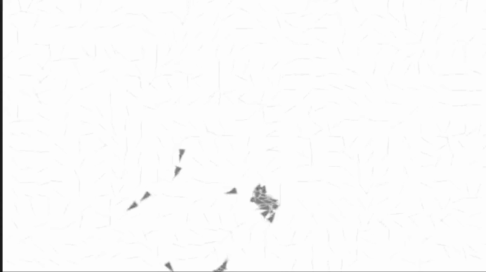

## ¿Cuál es la estructura de datos usada para el campo de flujo y cómo se generan sus vectores?

Este esta guardado como un arreglo bidimensional de vectores, donde cada celda representa una region del espacio. Es como nuna cuadricula y cada casilla tiene un vector que indican una direccion.
Estos vectores se generan usando Perlin noise, que da una sensacion mas natural, como un viento suave y continuo.

## ¿Cómo un agente usa el campo para calcular su fuerza de dirección?

Un agente busca en que celda del campo esta, usando su posicion luego lee el vector que hay en esa celda y lo interpreta como la direccion que este deberia seguir, como si estuviera siendo empujado por un viendo.
Despues de aplica ese vector como una fuerza ajustandolo con ```maxspeed``` y ```maxforce``` para que no se mueva de golpe o de manera poco natural.

## Parametros claves identificados

```resolution```: tamaño de acada celda en el campo de flujo. Si esta es muy grande los agentes sigues direcciones mas amplias si es pequeña el fujo es mas detallado.

```maxspeed```: la velocidad maxima que puede alcanzar un agente.

```maxforce```: la fuerza maxima con la que el agente puede cambiar de direccion, esto controla que tan brusco o suave gira.

## Modificacion al codigo

Modifique el valor de ```maxforce``` y el angulo del campo generado por el Perlin Noise para que los agentes se movieran de forma mas erratica, como si estuvieran nerviosos.



[Enlace a la simulacion](https://editor.p5js.org/DonTuvo/sketches/K6jalbehW)

``` js
class FlowField {
  constructor(r) {
    this.resolution = r;
    this.cols = floor(width / this.resolution);
    this.rows = floor(height / this.resolution);
    this.field = new Array(this.cols * this.rows);
    this.init();
  }

  init() {
    let xoff = 0;
    for (let i = 0; i < this.cols; i++) {
      let yoff = 0;
      for (let j = 0; j < this.rows; j++) {
        let index = i + j * this.cols;
        let angle = noise(xoff, yoff) * TWO_PI * 4; // más variación
        let v = p5.Vector.fromAngle(angle);
        v.setMag(1);
        this.field[index] = v;
        yoff += 0.1;
      }
      xoff += 0.1;
    }
  }

  lookup(lookup) {
    let column = constrain(floor(lookup.x / this.resolution), 0, this.cols - 1);
    let row = constrain(floor(lookup.y / this.resolution), 0, this.rows - 1);
    return this.field[column + row * this.cols].copy();
  }

  display() {
    for (let i = 0; i < this.cols; i++) {
      for (let j = 0; j < this.rows; j++) {
        let index = i + j * this.cols;
        let v = this.field[index];
        this.drawVector(v, i * this.resolution, j * this.resolution, this.resolution - 2);
      }
    }
  }

  drawVector(v, x, y, scayl) {
    push();
    let arrowsize = 4;
    translate(x, y);
    stroke(200, 100);
    rotate(v.heading());
    let len = v.mag() * scayl;
    line(0, 0, len, 0);
    pop();
  }
}

class Vehicle {
  constructor(x, y) {
    this.position = createVector(x, y);
    this.velocity = createVector(0, 0);
    this.acceleration = createVector(0, 0);
    this.r = 4;
    this.maxspeed = 4;
    this.maxforce = 0.5; // mayor fuerza
  }

  applyForce(force) {
    this.acceleration.add(force);
  }

  follow(flow) {
    let desired = flow.lookup(this.position);
    desired.setMag(this.maxspeed);
    let steer = p5.Vector.sub(desired, this.velocity);
    steer.limit(this.maxforce);
    this.applyForce(steer);
  }

  update() {
    this.velocity.add(this.acceleration);
    this.velocity.limit(this.maxspeed);
    this.position.add(this.velocity);
    this.acceleration.mult(0);
  }

  display() {
    let theta = this.velocity.heading() + PI / 2;
    fill(127);
    stroke(200);
    push();
    translate(this.position.x, this.position.y);
    rotate(theta);
    beginShape();
    vertex(0, -this.r * 2);
    vertex(-this.r, this.r * 2);
    vertex(this.r, this.r * 2);
    endShape(CLOSE);
    pop();
  }
}

let flowfield;
let vehicles = [];

function setup() {
  createCanvas(640, 360);
  flowfield = new FlowField(20);
  for (let i = 0; i < 100; i++) {
    vehicles[i] = new Vehicle(random(width), random(height));
  }
}

function draw() {
  background(255);
  flowfield.display();
  for (let v of vehicles) {
    v.follow(flowfield);
    v.update();
    v.display();
  }
}
```
