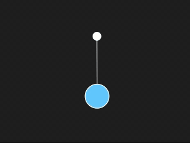

# Explicacion de terminos

### Engine
Es el motor de fisicas que actualiza la simulacion (gravedad, colisiones y movimientos=

### World
Es el "mundo" donde se agregan todos los cuerpos.

### Bodies
Son los objetos que interactuan entre si (cuadrados, circulos, rectangulos).

### Constraint
Es la conexion que tiene un bodie entre otro como cuerdas, uniones y bisagras.

### MouseConstraint
Permite interactuar el mouse con los objetos (arrastrandolos o soltandolos).

# Difilcutades iniciales 

1. La integracion entre p5js y matter.js puede ser confusa al principio, especialmente al manejar el sistema de dibujo
2. Me costo entender que Matter.js no usa directamente rect() o ellipse() para mostrar objetos. Debes extraer la posición y el ángulo del cuerpo y dibujarlo manualmente con p5.js.
3. Tambien es fácil olvidar usar Engine.update(engine) dentro de draw() para que la simulacion avance.


# Ejemplos 

## Cajas

[Enlace a la simulacion](https://editor.p5js.org/DonTuvo/sketches/9cJpd_SKb)


``` js

let Engine = Matter.Engine,
    World = Matter.World,
    Bodies = Matter.Bodies;

let engine, world;
let boxes = [];

function setup() {
  createCanvas(600, 400);
  engine = Engine.create();
  world = engine.world;

  let ground = Bodies.rectangle(300, height, 610, 60, { isStatic: true });
  World.add(world, ground);
}

function draw() {
  background(51);
  Engine.update(engine);

  fill(255);
  rectMode(CENTER);
  rect(300, height, 610, 60);

  for (let box of boxes) {
    box.show();
  }
}

function mousePressed() {
  boxes.push(new Box(mouseX, mouseY, 40, 40));
}

class Box {
  constructor(x, y, w, h) {
    this.body = Bodies.rectangle(x, y, w, h);
    this.w = w;
    this.h = h;
    World.add(world, this.body);
  }

  show() {
    let pos = this.body.position;
    let angle = this.body.angle;
    push();
    translate(pos.x, pos.y);
    rotate(angle);
    rectMode(CENTER);
    fill(200, 100, 100);
    rect(0, 0, this.w, this.h);
    pop();
  }
}
```

## Pendulo

[Enlace a la simulacion](https://editor.p5js.org/DonTuvo/sketches/lUrc7GY3W)



``` js
let Engine = Matter.Engine,
    World = Matter.World,
    Bodies = Matter.Bodies,
    Constraint = Matter.Constraint,
    Mouse = Matter.Mouse,
    MouseConstraint = Matter.MouseConstraint;

let engine, world;
let circle, anchor, rope;
let mConstraint;
let canvas;

function setup() {
  canvas = createCanvas(600, 400);
  engine = Engine.create();
  world = engine.world;


  anchor = Bodies.circle(300, 100, 10, { isStatic: true });
  World.add(world, anchor);


  circle = Bodies.circle(350, 250, 30);
  World.add(world, circle);

  rope = Constraint.create({
    bodyA: anchor,
    bodyB: circle,
    length: 150,
    stiffness: 0.9
  });
  World.add(world, rope);

  const canvasMouse = Mouse.create(canvas.elt);
  canvasMouse.pixelRatio = pixelDensity();

  const options = {
    mouse: canvasMouse,
    constraint: {
      stiffness: 0.2,
      render: { visible: false }
    }
  };

  mConstraint = MouseConstraint.create(engine, options);
  World.add(world, mConstraint);
}

function draw() {
  background(30);
  Engine.update(engine);


  stroke(255);
  strokeWeight(2);
  line(
    rope.bodyA.position.x,
    rope.bodyA.position.y,
    rope.bodyB.position.x,
    rope.bodyB.position.y
  );

  fill(255);
  ellipse(anchor.position.x, anchor.position.y, 20);


  fill(100, 200, 255);
  ellipse(circle.position.x, circle.position.y, 60);
}

```
