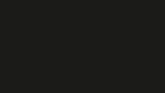

# BOUNCE
Utilice la palabra Bounce que en español significa rebotar, la animacion fisica representa la palabra ya que esta rebota al momento de caer y al momento de arrastrarla con el mouse tiende a rebotar bastante contra las paredes del canva.

## Aspectos tecnicos

### Letras
Cada letra de la palabra fue representada en un rectangulo (Bodies.Rectangle) en Matter.js y luego dibujado encima con text() de p5js. Cada cuerpo actua como fichas individuales que responden a la gravedad colisiones y fuerzas.

### Propiedades Fisicas

```restitution: 0.9```
Esta propiedad hizo que las letras rebotaran literalmente como si fueran pelotas de goma dando asi ejemplo de la palabra bounce.

```friction: 0.001```
Se mantuvo bajo para que las letras al rebotar no se frenaran tan facilmente.

```IsStatic: true```
Se uso para que las letras se mantuvieran dentro del canva creando paredes invisibles.

### Restricciones

Use un MouseConstrain de Matter.js para que se pudiera arrastrar las letras con el mouse.

## Codigo

[Enlace a la simulacion](https://editor.p5js.org/DonTuvo/sketches/-eDb7lS3V)



```js
let Engine = Matter.Engine,
    World = Matter.World,
    Bodies = Matter.Bodies,
    Mouse = Matter.Mouse,
    MouseConstraint = Matter.MouseConstraint;

let engine, world;
let letters = [];
let ground, leftWall, rightWall, ceiling;
let mConstraint;
let canvas;
let word = "BOUNCE";

function setup() {
  canvas = createCanvas(600, 300);
  engine = Engine.create();
  world = engine.world;

  ground = Bodies.rectangle(width / 2, height + 10, width, 20, { isStatic: true });
  leftWall = Bodies.rectangle(-10, height / 2, 20, height, { isStatic: true });
  rightWall = Bodies.rectangle(width + 10, height / 2, 20, height, { isStatic: true });
  ceiling = Bodies.rectangle(width / 2, -10, width, 20, { isStatic: true }); 

  World.add(world, [ground, leftWall, rightWall, ceiling]);


  let startX = 80;
  for (let i = 0; i < word.length; i++) {
    let letter = word.charAt(i);
    let body = Bodies.rectangle(startX + i * 70, 100, 60, 60, {
      restitution: 0.9,
      friction: 0.001
    });
    letters.push({ body, letter });
    World.add(world, body);
  }

  const canvasMouse = Mouse.create(canvas.elt);
  canvasMouse.pixelRatio = pixelDensity();

  const optionsMouse = {
    mouse: canvasMouse,
    constraint: {
      stiffness: 0.2,
      render: { visible: false }
    }
  };

  mConstraint = MouseConstraint.create(engine, optionsMouse);
  World.add(world, mConstraint);

  rectMode(CENTER);
  textAlign(CENTER, CENTER);
  textSize(32);
}

function draw() {
  background(30);
  Engine.update(engine);

  for (let obj of letters) {
    let pos = obj.body.position;
    let angle = obj.body.angle;
    push();
    translate(pos.x, pos.y);
    rotate(angle);

    fill(255);
    stroke(200);
    strokeWeight(1.5);
    rect(0, 0, 60, 60, 6);

    noStroke();
    fill(0);
    text(obj.letter, 0, 2);

    pop();
  }
}
```
